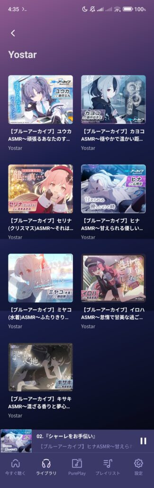
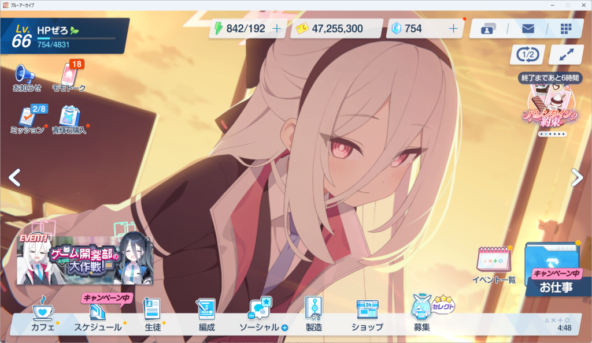

## ブルーアーカイブ！

韓国NEXONが開発しているゲームです。透き通るような世界観で送る学園RPG…。

そうですね。透き通ってます。

2020年にリリースされてます。

## 始めては辞めを繰り返してた

まずリリース日にスマホにインストールしました。しかし当時使っていたスマホが低スペ過ぎて遊べませんでした。

その後スマホを買い替え、ブルアカができる程度のスペックになったので始めました。

しかし、毎日ログインとか育成とかそういうのが面倒くさくて、数日で辞めてしまいました。(????)

んで今年に入ってからまた始めたわけですね。

## ASMRを買ってしまった

今年に入ってから始めた理由、それは**ASMRを買ってしまった**からなんです。

ブルーアーカイブのASMR、買ってますでしょ。  
ユウカ、カヨコ、セリナ、ヒナ、ミヤコ、イロハ、キサキ…。

まだまだ全然買えていませんが…。全員好きなキャラクターなので、仕方がないじゃないか。

ブルアカのASMRというかYostarの作るASMRはその作品の知識がなくても十分楽しめます。アズレンのASMRもかなり良いです。

ですが、やっぱ知識入れといたほうがいいってことで、始めたわけですな。

## 現状

とりあえず飽きる気配は感じていません。

なんとなくで進めていて、Lvは66です。まだまだですけど。

あとはYouTubeで更新されているショート動画とかを見て癒やされてます。(コメントは見ないようにしている)

ブルアカ、、、最高だな。

## おわり

ゴミ記事です。ごめんね。

推しはヒナです。かわいい。可愛いんだよ。
