## AI

なんでもかんでもAI、AIです。AIに傾倒していきましょう。

今回はローカルで動かすやつです。llama.cppってやつ。

https://github.com/ggml-org/llama.cpp

やっていきましょう。

## 環境

| CPU | Ryzen 7 5700X |
| --- | --- |
| メモリ | DDR4 3200 32GB |
| SSD | Crucial T500 1TB |
| GPU | RTX 4060 Ti 16GB |
| OS | Windows 11 25H2 26200.7840 |

あまり大きいモデルは動かせませんが、~14GBくらいまでなら全部VRAMに展開出来て、コンテキストはRAMを使うことができるので、割と余裕はありそう…？

よくわがんね！

## 準備

### cuda toolkitのインストール

https://developer.nvidia.com/cuda-downloads

↑からインストーラーをダウンロードします。

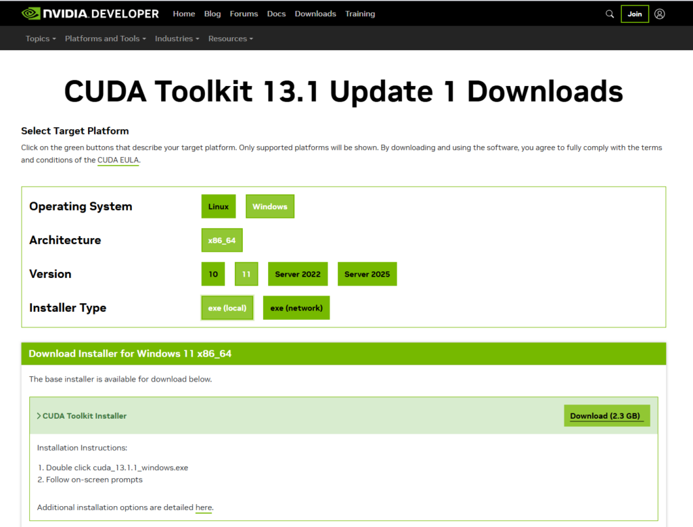

オペレーティングシステムは**Windows**、アーキテクチャは**x86_64**、バージョンは**11**、インストーラータイプは**ローカル**にしました。

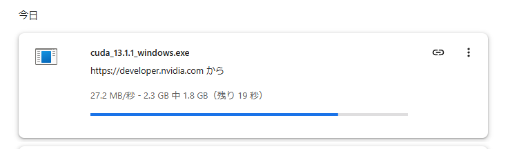

我が家の激遅回線ではものごっつ時間がかかります。待ちます。

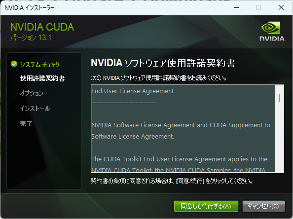

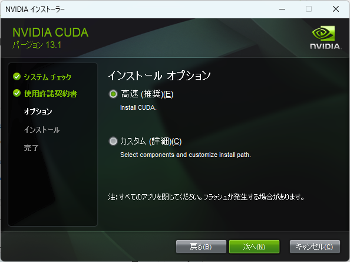

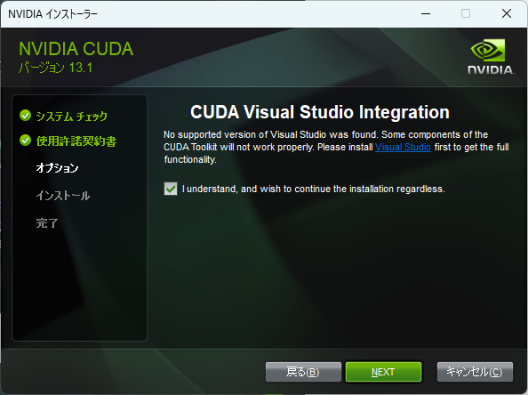

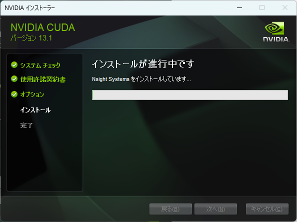

ウィザードに従ってインストールを行います。

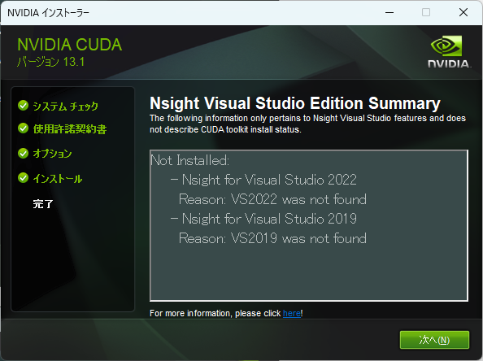

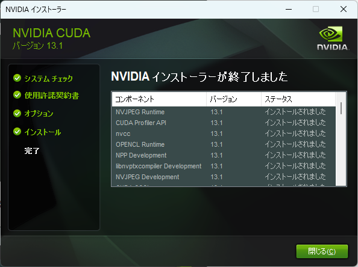

インストールできたみたいです。

ターミナルを開いて次のコマンドを実行して

```
nvcc --version
```

```
nvcc --version
```

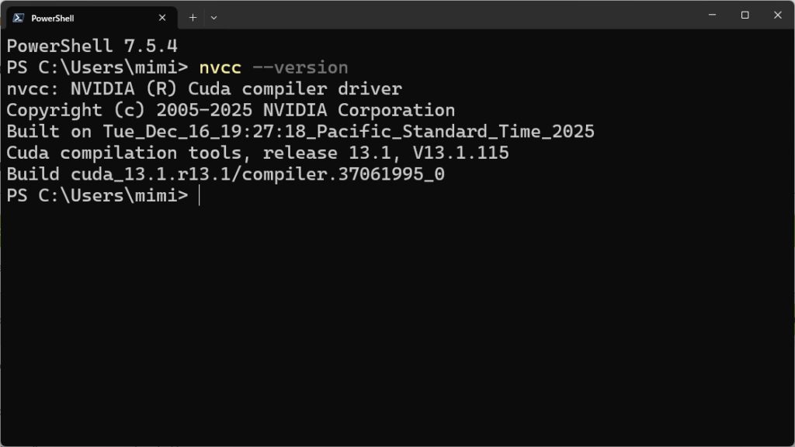

画像のようにバージョンが帰ってくればOKです。

### llama.cppのダウンロード

https://github.com/ggml-org/llama.cpp/releases/latest

にアクセスして、

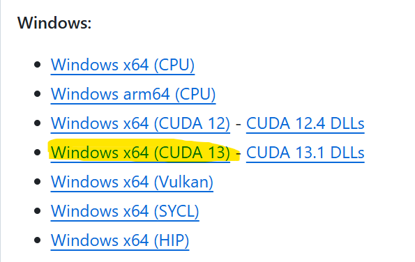

Windowsの**Windows x64 (CUDA 13)**をダウンロードします。

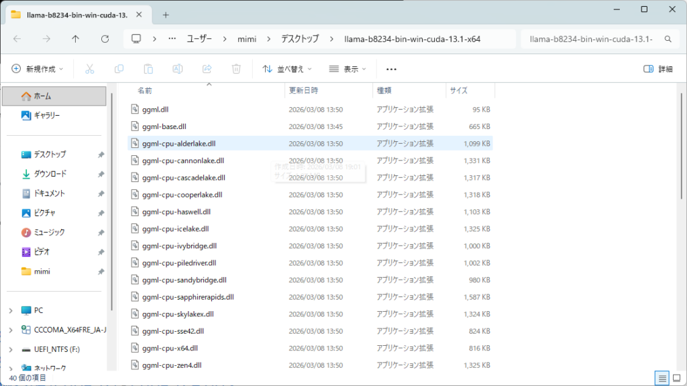

適当に展開しておきます。

## モデルを選ぼう

今回はQwen3を動かしていこうと思います。

https://huggingface.co/unsloth/Qwen3-14B-GGUF

有志が公開している量子化されたGGUFモデルを使います。いずれ量子化にも挑戦してみたいところ。

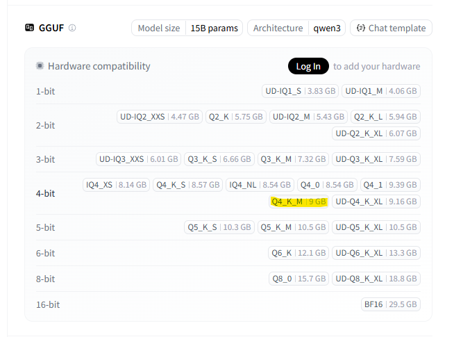

今回はQ4_K_Mをダウンロードします。

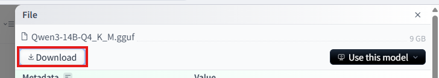

例に漏れず今回もクソ長いダウンロードがあります。泣きたいです。

## 動かしてみる

ZIPを展開したディレクトリでターミナルを開いて、

```
.\llama-server -m <モデルのパス>
```

```
.\llama-server -m <モデルのパス>
```

を実行する。私の場合は

```
.\llama-server -m "C:\Users\mimi\Downloads\Qwen3-14B-Q4_K_M.gguf"
```

```
.\llama-server -m "C:\Users\mimi\Downloads\Qwen3-14B-Q4_K_M.gguf"
```

という感じ。

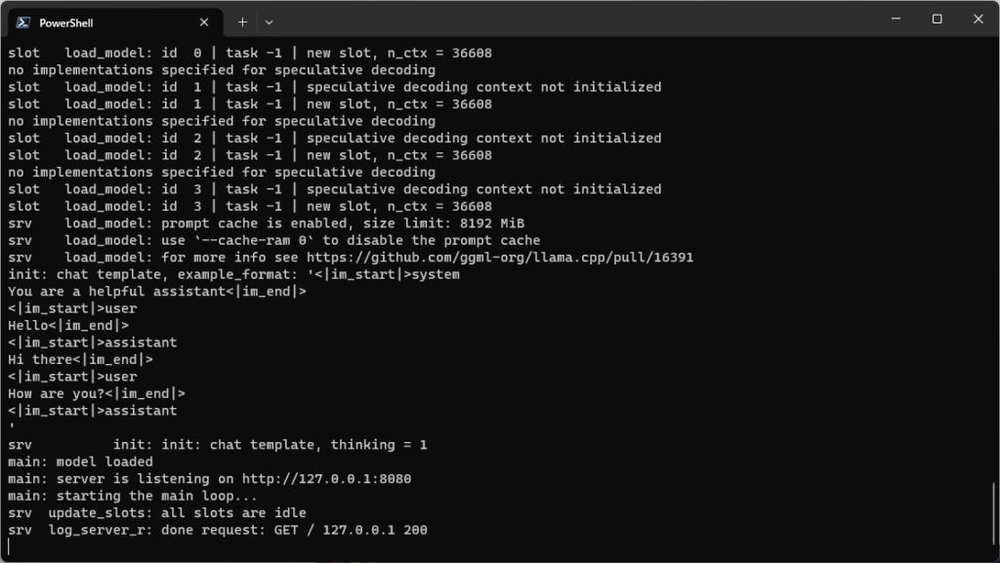

起動すると文字がバーッて出た後、URLが現れるのでアクセスすると…

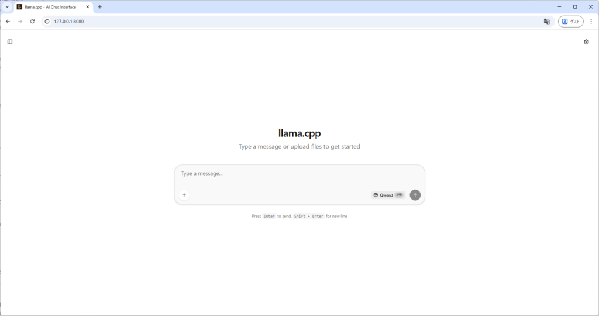

チャット画面が現れます。

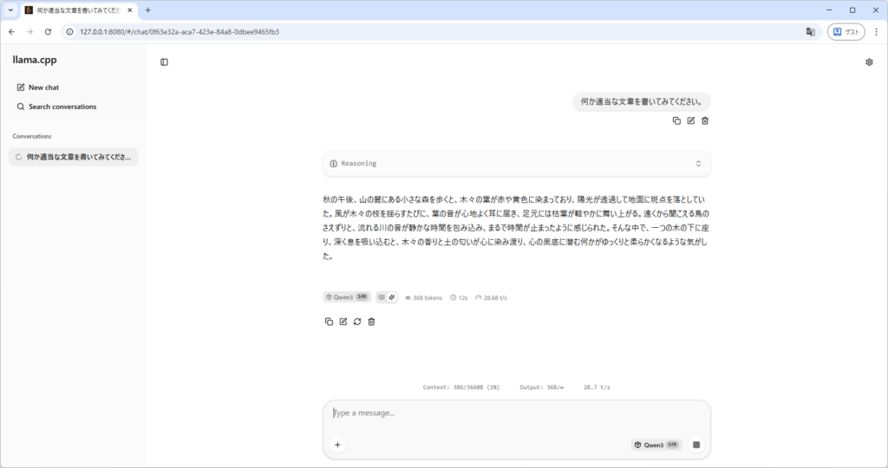

ちゃんと生成もできている。

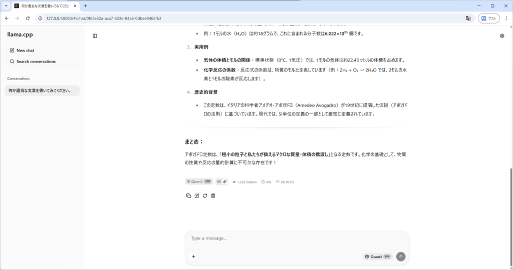

正しそうなことも言える。

生成速度は28.10トークン/秒で普通くらいの速度だと思います。遅いなぁとは思わない。

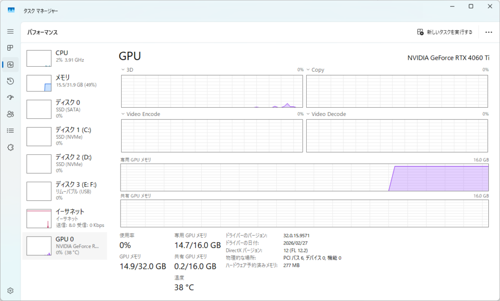

VRAMは14.7GB使っている。余裕はない。

## 終わり

今回はここまでです。クラスターも持っていないので大きなモデルを動作させることはできませんが、ロマンは満たせると思います。

たぶん近いうちに量子化してみようみたいな記事を書くかもしれません。たぶん？
